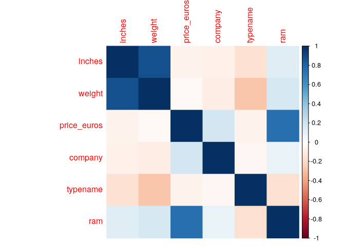
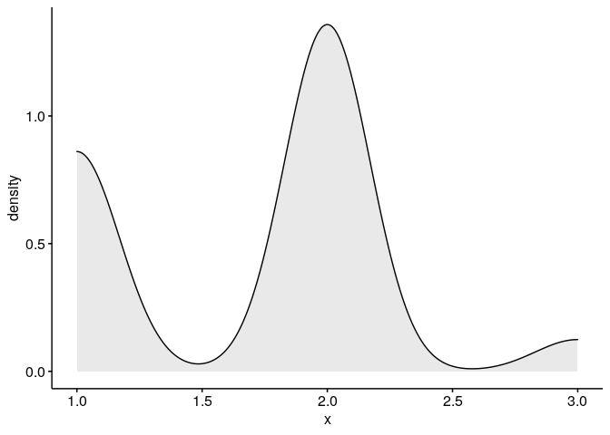

# Zadanie
Otrzymują Państwo zbiór danych opisujących laptopy dostępne w sprzedaży pewnego sklepu internetowego. Zbiór `laptops.csv` zawiera następujące zmienne:

* `inches` - rozmiar przekątnej w calach
*  `weight` - waga laptopa
*  `price_euros` - cena laptopa w euro
*  `company` - producent laptopa (1 - Acer, 2 - Asus, 3 - Dell, 4 - HP, 5 - Lenovo, 6 - MSI, 7 - Toshiba)
* `typename` - typ laptopa (1 - 2w1, 2 - gaming, 3 - netbook, 4 - notebook, 5 - ultrabook, 6 - stacja robocza)
* `ram` - ilość RAM laptopa (1 - $GB, 2 - 8GB, 3 - 16GB, 4 - 32GB)

Państwa zadaniem jest w oparciu o podany zbiór weryfikacja następujących hipotez:

1. Stosowana ilość RAM w laptopie jest zależna od jego producenta.
2. Rozkład stosowanych pamięci RAM w notebookach HP i Lenovo jest taki sam
3. Średnia zlogarytmowana cena notebooka Dell i HP jest równa

W rozwiązaniu, dla każdej hipotezy proszę obliczyć wartość statystyki testowej, p-value oraz skonstruować obszar krytyczny. Wybór testu należy uzasadnić. Tam, gdzie zasadne, sprawdzić, czy założenia testu są spełnione. 


<br>
Wczytujemy dane:

```r
data <- read.table('laptops.csv', header = TRUE, sep = ';')
head(data)
```

```
##   inches weight price_euros company typename ram
## 1   15.6   1.86      575.00       4        4   2
## 2   15.6   2.10      400.00       1        4   1
## 3   14.0   1.30     1495.00       2        5   3
## 4   14.0   1.60      770.00       1        5   2
## 5   15.6   1.86      393.90       4        4   1
## 6   15.6   1.86      344.99       4        4   1
```
# Stosowana ilość RAM w lapopie jest zależna od jego producenta
Sporzadzimy correlogram:

```r
M <- cor(data)
corrplot(M, method = 'color')
```

<!-- -->
Możemy zauważyc, że kolumna 'ram' ma niska korelacje z kolumna 'company', zatem na podstawie samego wykresu możemy sądzić, że stosowana ilość RAM nie jest zależna od jego producenta. Żeby zweryfikować hipotezę przeprowadzimy test chi-kwadrat.
<br>
Przyjmijmy:
<br>
\(H_0:\) Stosowana ilość RAM w laptopie jest niezależna od jego producenta
<br>
\(H_1:\) Stosowana ilosć RAM w laptopie NIE jest niezależna od jego producenta
<br>
oraz przyjmujemy poziom istotności \(\alpha = 0.05\).

```r
slownik_ram <- c('1' = '4GB', '2' = '8GB',
             '3' = '16GB', '4' = '32GB')
data$ram <- slownik_ram[as.character(data$ram)]
```

Poniżej znajduje się podsumowanie ilości laptopów z danym RAMem w zależoności od producenta:

```r
data1 <- data
slownik_company <- c('1' = 'Acer', '2' = 'Asus',
             '3' = 'Dell', '4' = 'HP',
             '5' = 'Lenovo', '6' = 'MSI',
             '7' = 'Toshiba')
data1$company <- slownik_company[as.character(data1$company)]
table(data1$ram, data1$company)
```

```
##       
##        Acer Asus Dell  HP Lenovo MSI Toshiba
##   16GB    4   35   54  13     39  31       8
##   32GB    0    3    7   0      3   1       1
##   4GB    57   45   63  90     89   0      14
##   8GB    33   61  161 142    141  22      25
```
Narysujmy wykres kwantyl-kwantyl, aby ocenić, czy zmienna ma rozkład normalny

```r
ggdensity(data$company, fill = "lightgray")
```

<!-- -->

```r
ggqqplot(data$company)
```

<!-- -->
<br>
Zatem widzimy, że kolumna company nie ma rozkładu normalnego.
<br>
Przeprowadzimy test \(\chi^2\) 


```r
chisq <- chisq.test(table(data$ram, data$company))
chisq
```

```
## 
## 	Pearson's Chi-squared test
## 
## data:  table(data$ram, data$company)
## X-squared = 164.23, df = 18, p-value < 2.2e-16
```

```r
chisq$observed
```

```
##       
##          1   2   3   4   5   6   7
##   16GB   4  35  54  13  39  31   8
##   32GB   0   3   7   0   3   1   1
##   4GB   57  45  63  90  89   0  14
##   8GB   33  61 161 142 141  22  25
```

```r
round(chisq$expected,2)
```

```
##       
##            1     2      3      4      5     6     7
##   16GB 15.15 23.20  45.92  39.47  43.82  8.70  7.73
##   32GB  1.23  1.89   3.74   3.22   3.57  0.71  0.63
##   4GB  29.47 45.14  89.34  76.80  85.27 16.93 15.05
##   8GB  48.15 73.77 145.99 125.50 139.33 27.66 24.59
```

```r
round(chisq$residuals, 3)
```

```
##       
##             1      2      3      4      5      6      7
##   16GB -2.864  2.449  1.192 -4.214 -0.729  7.560  0.096
##   32GB -1.111  0.806  1.683 -1.794 -0.303  0.345  0.465
##   4GB   5.072 -0.021 -2.787  1.506  0.404 -4.114 -0.270
##   8GB  -2.184 -1.486  1.242  1.473  0.141 -1.077  0.083
```

```r
contrib <- 100*chisq$residuals^2/chisq$statistic
round(contrib, 3)
```

```
##       
##             1      2      3      4      5      6      7
##   16GB  4.994  3.653  0.866 10.811  0.323 34.800  0.006
##   32GB  0.752  0.396  1.725  1.959  0.056  0.073  0.132
##   4GB  15.663  0.000  4.729  1.381  0.099 10.307  0.044
##   8GB   2.903  1.345  0.939  1.320  0.012  0.706  0.004
```


```r
corrplot(contrib, is.cor = FALSE)
```

<!-- -->
<br>
Na podstawie powyższego wykresu możemy stwierdzić, że:

1. Laptopy marki MSI są silnie powiązane z RAMem 16GB.
2. Laptopy marki Acer są silnie powiązane z RAMem 4GB.


```r
chisq$p.value
```

```
## [1] 1.232738e-25
```

Na poziomie istotności \(\alpha = 0.05\) otrzymana p-value jest mniejsza od wartości \(\alpha\), zatem mamy podstawę do odrzucenia hipotezy zerowej. Zatem stosowana ilość RAM w laptopie jest zależna od jego producenta, co oznacza, że sugerowanie się korelacją nie było zasadne. 


# Rozkład stosowanych pamięci RAM w notebookach HP i Lenovo jest taki sam

Skorzystamy z fragmentu poprzedniego podpunktu. 

```r
data_true <- read.table('laptops.csv', header = TRUE, sep = ';')
data_2 <- data_true[data_true$company == 4 | data_true$company == 5, ]
data_2pom <- data_2
slownik_company <- c('1' = 'Acer', '2' = 'Asus',
             '3' = 'Dell', '4' = 'HP',
             '5' = 'Lenovo', '6' = 'MSI',
             '7' = 'Toshiba')
slownik_ram <- c('1' = '4GB', '2' = '8GB',
             '3' = '16GB', '4' = '32GB')
data_2pom$ram <- slownik_ram[as.character(data_2pom$ram)]
data_2pom$company <- slownik_company[as.character(data_2pom$company)]
table(data_2pom$ram, data_2pom$company)
```

```
##       
##         HP Lenovo
##   16GB  13     39
##   32GB   0      3
##   4GB   90     89
##   8GB  142    141
```
Przeprowadzimy z-test, aby porównać rozkłady pamięci RAM.

```r
z.test(table(data_2$ram, data_2$company), sigma.x = 1)
```

```
## 
## 	One-sample z-Test
## 
## data:  table(data_2$ram, data_2$company)
## z = 182.79, p-value < 2.2e-16
## alternative hypothesis: true mean is not equal to 0
## 95 percent confidence interval:
##  63.93205 65.31795
## sample estimates:
## mean of x 
##    64.625
```
Na poziomie istotności \(\alpha = 0.05\) otrzymana p-value jest mniejsza od wartości \(\alpha\), zatem mamy podstawę do odrzucenia hipotezy zerowej. 


```r
data_2_hp <- data_2[data_2$company == 4, ]
ggdensity(data_2_hp$ram, fill = "lightgray")
```

<!-- -->

```r
ggqqplot(data_2_hp$ram)
```

<!-- -->

```r
data_2_lenovo <- data_2[data_2$company == 5, ]
ggdensity(data_2_lenovo$ram, fill = "lightgray")
```

<!-- -->

```r
ggqqplot(data_2_lenovo$ram)
```

<!-- -->


# Średnia zlogarytmowana cena notebooka Dell i HP jest równa


Aby zweryfikować ostatnią hipotezę użyjemy t-testu. Niech:
<br>
\(H_0:\) średnie zlogarytmowane ceny notebooka Dell i HP są równe
<br>
\(H_1:\) średnie zlogarytmowane ceny notebooka Dell i HP NIE są równe
<br>
oraz przyjmujemy poziom istotności \(\alpha = 0.05\).
<br>
Na początku obliczmy logarytmy cen notebooków.

```r
data$price_euros <- sapply(data$price_euros, log)
```


```r
data_dell <- data[data$company == 3, ]
data_hp <- data[data$company == 4, ]
t_test_ceny <- t.test(data_dell$price_euros, data_hp$price_euros)
t_test_ceny
```

```
## 
## 	Welch Two Sample t-test
## 
## data:  data_dell$price_euros and data_hp$price_euros
## t = 2.1851, df = 503.74, p-value = 0.02934
## alternative hypothesis: true difference in means is not equal to 0
## 95 percent confidence interval:
##  0.01045117 0.19677745
## sample estimates:
## mean of x mean of y 
##  6.958167  6.854553
```
Na poziomie istotności \(\alpha = 0.05\) otrzymana p-value jest mniejsza od wartości \(\alpha\), zatem mamy podstawę do odrzucenia hipotezy zerowej. Czyli średnia zlogarytmowana cena notebooka Dell i HP nie są sobie równe. Możemy to sprawdzić obliczając odpowiednie średnie:


```r
mean_dell <- mean(data_dell$price_euros)
mean_hp <- mean(data_hp$price_euros)
mean_dell
```

```
## [1] 6.958167
```

```r
mean_hp
```

```
## [1] 6.854553
```
