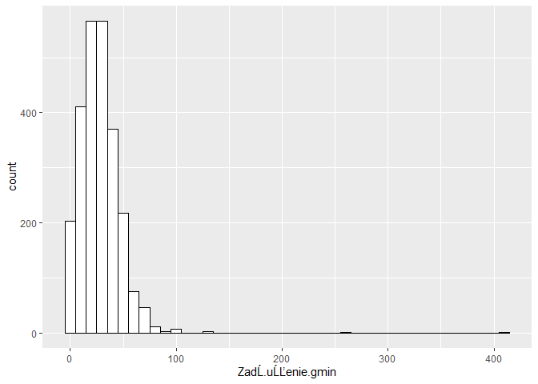

# Zadanie 3 z labu 2

Napisz funkcje sample_sd (parametry N,n)


```r
sample_sd <- function(N, n) {
    M=matrix(rnorm(n*N,0,1),ncol=N)
    return(apply(M, 2, sd))
}
```

Utwórz wektor


```r
n <- 2:100
```

Dla wektora otrzymaj 100 estymowanych odchyleń standardowych

```r
SD <- sapply(n, sample_sd, N=100)
```

Otrzymaj ramke danych dla potrzeb zadania

```r
sd_to_plot <- data.frame('est_SD' = c(SD), 'liczebnosc_proby' = rep(n, each=100))
str(sd_to_plot)
```

```
## 'data.frame':	9900 obs. of  2 variables:
##  $ est_SD          : num  0.466 0.145 0.976 0.63 3.737 ...
##  $ liczebnosc_proby: int  2 2 2 2 2 2 2 2 2 2 ...
```

Wykres

```r
library(ggplot2)
# plotno (obszar wykresu) + wykres rozproszenia + linia trendu
ggplot(sd_to_plot) + geom_point(aes(x=liczebnosc_proby, y=est_SD)) + geom_smooth(aes(x=liczebnosc_proby , y=est_SD)) + theme_minimal()
```

```
## `geom_smooth()` using method = 'gam' and formula 'y ~ s(x, bs = "cs")'
```

<!-- -->

# Zadanie 1 z labu 3


```r
dane <- read.csv('https://mimuw.edu.pl/~dot/resources/sad/Zadluzenie_gmin.csv', header=TRUE, sep ='\t')
summary(dane)
```

```
##     Region            Kod.Teryt          Kod.BDR          ZadĹ.uĹĽenie.gmin
##  Length:2478        Min.   : 201011   Min.   :1.102e+09   Min.   :  0.00   
##  Class :character   1st Qu.:1002045   1st Qu.:2.122e+09   1st Qu.: 15.18   
##  Mode  :character   Median :1433067   Median :3.204e+09   Median : 26.09   
##                     Mean   :1652044   Mean   :3.459e+09   Mean   : 27.69   
##                     3rd Qu.:2413060   3rd Qu.:5.020e+09   3rd Qu.: 37.80   
##                     Max.   :3263011   Max.   :6.286e+09   Max.   :405.66   
##                                       NA's   :1                            
##   Jednostka             Okres     
##  Length:2478        Min.   :2015  
##  Class :character   1st Qu.:2015  
##  Mode  :character   Median :2015  
##                     Mean   :2015  
##                     3rd Qu.:2015  
##                     Max.   :2015  
## 
```

```r
ggplot(dane, aes(x=ZadĹ.uĹĽenie.gmin)) + geom_histogram(binwidth=10, color="black", fill="white")
```

<!-- -->
