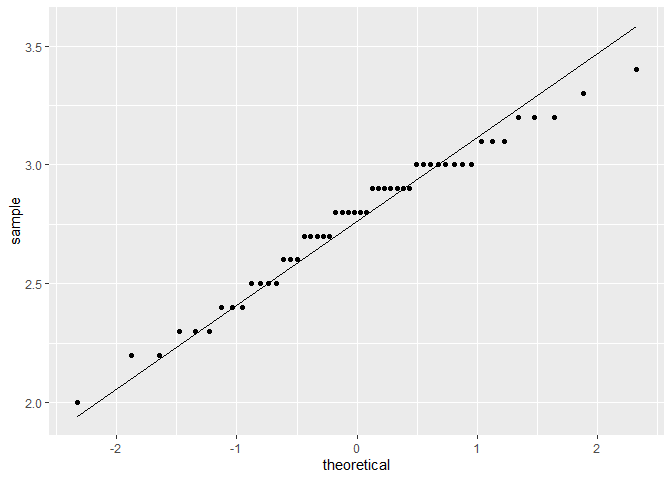
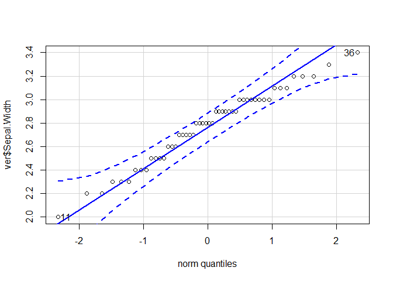

Zadanie 3 i 4 (z labu 3)


```r
# na wszelki wypadek, bo czasem problemy 
library(datasets)

# wczytanie danych
data(iris)

# wybrac wiersze z versicolor
ver <- iris[iris$Species=="versicolor",]
a<-ver$Sepal.Width
```


Ocena czy Sepal.Width ma rozkład normalny

```r
library(ggplot2)
ggplot(ver) + stat_qq(aes(sample = Sepal.Width)) + stat_qq_line(aes(sample = Sepal.Width))
```

<!-- -->

Korzystajac z biblioteki car

```r
library(car)
```

```
## Warning: package 'car' was built under R version 4.0.4
```

```
## Loading required package: carData
```

```r
qqPlot(ver$Sepal.Width)
```

<!-- -->

```
## [1] 11 36
```


```r
shapiro.test(ver$Sepal.Width)
```

```
## 
## 	Shapiro-Wilk normality test
## 
## data:  ver$Sepal.Width
## W = 0.97413, p-value = 0.338
```


Obliczenie przedziałów ufności dla średniej wartości Sepal.Width dla gatunku versicolor


```r
# nasz przedzial ufnosci bedzie 1- alpha = 95%
n = nrow(ver)
alpha = 0.05

studentyzowany1 = mean(ver$Sepal.Width) + (qt((1 - alpha/2),n-1)/sqrt(n-1)) * sd(ver$Sepal.Width)
studentyzowany2 = mean(ver$Sepal.Width) - (qt((1 - alpha/2),n-1)/sqrt(n-1)) * sd(ver$Sepal.Width)

asympt1 = mean(ver$Sepal.Width) + (qnorm((1 - alpha/2))/sqrt(n))*sd(ver$Sepal.Width)
asympt2 = mean(ver$Sepal.Width) - (qnorm((1 - alpha/2))/sqrt(n)) * sd(ver$Sepal.Width)
```
