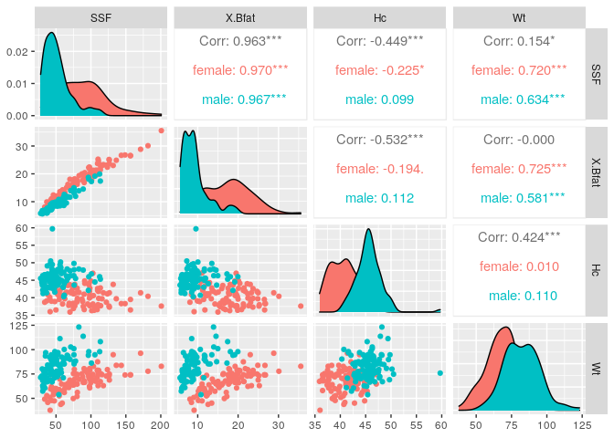

# Dokonczenie labu 5


```r
library(class)

set.seed(9042021)

w <- read.table("https://mimuw.edu.pl/~dot/resources/sad/wine.csv",
                sep="\t", header=T, as.is=T )

# centrowanie
w[,-1] <- apply(w[,-1], 2, function(x) x-mean(x))
# skalowanie
w[,-1] <- apply(w[,-1], 2, function(x) x/sd(x))

as.factor(w[,1])
```

```
##    [1] 6 6 6 6 6 6 6 6 6 6 5 5 5 7 5 7 6 8 6 5 8 7 8 5 6 6 6 6 6 7 6 6 6 6 5 5 5
##   [38] 6 5 5 6 6 6 6 6 7 4 5 6 5 6 7 7 6 6 6 6 6 6 6 6 6 5 6 6 5 7 5 8 5 6 5 5 6
##   [75] 8 5 7 7 5 5 6 6 5 6 5 6 6 6 5 6 6 5 7 7 7 6 6 7 4 6 5 5 5 5 5 6 5 6 6 5 6
##  [112] 5 5 5 5 4 6 6 5 5 5 5 5 6 6 6 5 7 7 6 5 7 5 5 5 5 6 5 7 6 5 5 6 6 6 6 6 4
##  [149] 7 6 7 6 6 5 6 6 6 7 8 8 7 5 5 6 5 5 6 7 5 5 6 6 4 7 5 6 4 5 4 6 6 5 5 6 5
##  [186] 5 6 5 8 4 6 5 6 5 5 6 5 5 5 5 5 5 5 6 4 5 5 4 5 6 5 7 5 6 7 5 5 5 5 5 5 6
##  [223] 7 6 6 5 6 6 6 5 4 6 6 6 6 6 6 6 7 6 5 5 7 6 5 6 7 7 7 5 4 3 5 3 6 8 7 7 6
##  [260] 4 6 5 5 6 6 5 6 5 6 6 6 5 5 5 5 6 6 5 4 7 8 8 4 5 5 5 6 7 7 7 7 6 5 7 3 6
##  [297] 5 7 6 6 6 6 6 6 6 6 5 6 7 6 7 8 6 6 5 6 6 5 7 6 7 5 6 6 5 5 6 6 6 5 8 5 6
##  [334] 5 5 6 6 6 5 7 7 6 6 5 6 6 7 6 6 5 7 7 6 7 6 6 6 6 6 6 6 5 6 6 7 7 6 6 6 5
##  [371] 6 6 5 6 7 7 7 7 6 7 7 6 6 6 7 7 7 5 6 7 7 5 6 6 5 5 5 6 5 6 6 5 5 5 6 5 7
##  [408] 5 6 5 6 6 5 5 6 6 6 5 6 6 7 6 6 6 7 6 6 5 5 5 5 5 7 4 8 7 5 8 7 5 7 6 8 6
##  [445] 6 3 5 6 6 7 5 5 7 7 7 6 7 5 6 5 5 5 5 6 5 5 6 6 5 5 6 5 6 7 6 5 7 6 6 6 5
##  [482] 6 5 5 5 6 6 6 6 6 6 7 6 6 6 6 4 6 5 4 6 6 6 5 6 6 5 7 6 7 6 6 6 6 7 6 5 6
##  [519] 6 5 5 5 6 6 5 6 4 6 6 6 6 5 6 6 6 5 5 6 5 6 4 5 6 6 6 6 6 6 7 5 7 7 7 7 7
##  [556] 7 5 6 5 6 7 5 6 7 5 6 6 5 6 6 5 7 5 7 7 6 6 7 7 7 5 5 6 6 7 6 6 7 7 6 5 6
##  [593] 5 5 5 7 5 6 8 7 6 6 5 5 6 6 5 5 5 6 8 6 5 5 5 5 7 6 6 6 5 5 6 5 5 8 4 6 6
##  [630] 6 5 5 6 5 6 6 7 5 5 5 7 4 6 5 5 5 4 6 5 7 7 7 7 6 7 6 6 5 5 4 5 7 4 5 6 5
##  [667] 6 6 6 5 6 6 8 6 5 6 6 7 7 7 5 5 6 5 5 5 7 4 6 7 4 6 5 5 6 5 6 5 5 5 5 7 4
##  [704] 6 6 5 5 6 6 5 5 6 6 5 6 7 6 5 7 7 5 5 6 8 7 5 7 5 5 5 6 6 7 6 5 6 6 5 7 6
##  [741] 3 6 6 5 5 6 6 6 6 6 6 6 6 6 5 7 5 6 7 7 6 6 5 6 6 6 5 6 7 7 7 7 7 5 9 6 6
##  [778] 5 7 8 4 6 7 8 5 6 6 6 7 6 6 7 5 7 5 5 6 6 6 8 6 5 5 7 6 6 5 6 6 6 5 6 7 6
##  [815] 6 5 5 5 5 5 9 6 5 6 5 6 6 9 7 7 6 4 8 6 6 8 8 8 8 7 7 7 7 7 8 8 5 5 7 6 7
##  [852] 5 7 5 7 7 5 5 7 5 8 7 6 6 5 6 7 8 7 6 5 5 6 3 5 7 9 6 6 8 7 6 6 6 6 7 6 7
##  [889] 6 7 6 7 5 7 7 6 6 6 6 6 7 6 5 6 8 4 4 8 4 5 5 5 5 5 4 5 7 6 6 7 7 6 6 6 8
##  [926] 5 5 7 5 5 7 5 6 5 5 5 5 5 6 7 5 6 7 7 7 7 5 5 4 5 5 6 6 5 6 5 5 7 7 6 6 7
##  [963] 6 6 6 5 6 6 7 7 7 7 6 7 6 5 6 5 7 5 6 7 6 6 5 6 6 6 5 7 6 4 5 4 6 6 5 6 6
## [1000] 7 7 5 6 7 6 6 6 5 7 6 6 7 6 5 5 5 5 6 6 6 7 7 8 6 6 6 6 4 7 4 6 6 6 6 3 6
## [1037] 5 5 7 5 4 5 4 5 7 5 5 5 5 6 5 6 5 4 5 5 6 5 6 4 7 5 5 5 6 5 6 7 7 6 7 5 7
## [1074] 5 6 7 6 5 5 6 7 6 6 6 7 5 8 8 6 7 6 6 6 7 5 8 6 7 6 7 6 6 5 5 5 7 8 7 7 4
## [1111] 7 6 6 5 4 8 5 5 5 5 6 6 7 5 5 6 7 7 5 7 6 6 5 5 5 6 8 8 5 5 6 5 5 5 5 5 5
## [1148] 5 6 5 5 5 4 6 4 4 6 6 6 6 6 6 7 6 6 5 5 6 5 6 6 5 6 5 6 5 7 6 5 5 5 6 5 6
## [1185] 7 5 5 8 6 5 6 7 6 7 6 6 7 7 6 7 6 7 5 6 6 5 6 5 6 6 6 5 6 6 6 5 8 5 8 8 6
## [1222] 7 6 5 7 6 7 5 6 3 6 7 7 6 6 5 6 5 7 5 6 7 7 7 5 4 7 6 7 5 7 5 6 7 5 6 6 6
## [1259] 6 6 6 6 6 6 5 7 8 7 5 6 7 5 5 5 6 6 7 5 6 6 6 7 5 8 7 6 7 7 7 6 6 6 6 4 4
## [1296] 6 6 7 6 5 6 5 6 6 5 7 8 5 6 6 6 6 5 5 6 6 6 5 6 5 6 6 6 5 6 7 6 6 6 5 5 6
## [1333] 7 8 6 6 8 5 5 6 6 5 6 6 8 8 7 7 8 4 7 7 6 5 5 5 6 6 8 7 6 7 7 4 5 7 6 5 6
## [1370] 5 6 7 6 6 7 7 6 6 7 6 7 7 6 6 6 5 7 6 7 6 6 6 6 6 7 7 7 7 7 6 7 6 8 8 5 4
## [1407] 8 6 7 6 6 6 8 6 6 5 6 3 5 7 4 6 5 4 6 6 6 5 7 5 4 5 7 6 5 5 5 7 5 5 5 5 5
## [1444] 6 6 6 6 6 6 6 6 5 6 7 5 5 6 6 6 6 6 6 6 6 8 5 6 7 5 5 7 6 5 6 4 6 5 6 6 6
## [1481] 6 6 6 4 3 6 6 6 6 5 6 5 5 8 8 7 5 7 6 6 7 5 5 7 8 7 6 6 6 5 5 6 7 6 7 6 6
## [1518] 6 6 5 6 5 5 6 6 5 6 6 6 6 5 7 7 6 6 6 5 6 6 6 6 4 6 6 5 6 6 6 6 6 6 6 7 7
## [1555] 7 7 6 6 4 4 6 5 7 6 5 6 5 5 6 5 5 6 6 5 4 6 6 4 5 4 5 6 7 5 6 5 5 6 5 6 6
## [1592] 6 6 6 6 6 5 6 6 6 6 6 5 7 5 9 6 7 5 7 6 6 7 7 5 6 6 6 6 8 7 5 6 6 7 6 6 5
## [1629] 6 6 5 6 8 7 6 6 5 6 5 5 5 6 7 7 7 7 6 7 5 4 7 6 4 6 5 5 5 6 5 5 6 6 7 6 4
## [1666] 8 5 6 7 6 6 7 5 5 6 5 7 6 6 5 5 6 7 7 7 7 5 7 3 6 4 7 6 5 6 6 6 6 6 6 6 5
## [1703] 4 5 5 6 6 5 4 5 5 5 6 6 5 8 6 6 4 6 7 7 6 8 6 6 6 6 5 6 6 6 5 6 6 6 5 6 5
## [1740] 4 6 6 6 6 5 5 5 6 5 6 6 7 6 7 6 6 5 5 5 5 6 6 7 6 5 5 5 5 5 7 6 6 6 6 6 6
## [1777] 5 6 8 8 5 4 6 6 7 6 7 7 5 7 5 5 6 5 5 6 5 8 6 6 6 5 6 6 6 5 5 6 5 6 6 5 6
## [1814] 6 7 6 7 4 6 6 6 5 7 6 5 5 5 6 6 7 7 7 7 7 6 5 6 7 6 6 5 7 6 6 6 5 5 5 5 6
## [1851] 7 6 7 5 7 6 4 5 5 6 6 6 7 5 6 6 6 6 7 7 6 6 5 5 5 5 6 6 6 6 5 6 5 5 5 6 5
## [1888] 5 5 5 5 5 5 5 5 6 6 6 6 7 6 5 6 5 6 6 5 7 7 5 5 6 6 6 6 7 5 6 6 6 7 5 5 5
## [1925] 4 6 6 5 6 5 6 3 6 5 6 5 6 7 5 5 5 5 5 5 5 6 6 5 7 5 5 4 7 6 5 5 5 6 6 5 5
## [1962] 5 5 6 5 6 6 7 6 7 6 7 5 5 5 6 5 6 6 6 8 8 8 8 8 6 6 5 6 7 4 8 5 6 6 6 6 6
## [1999] 6 6 5 5 6 6 6 6 6 6 5 7 6 5 5 6 5 6 7 5 7 6 6 6 6 6 5 5 5 5 6 6 6 5 6 5 5
## [2036] 5 6 5 5 5 6 5 6 6 6 5 5 5 5 7 3 5 5 5 5 6 5 7 5 5 5 6 5 5 6 5 5 5 6 7 6 6
## [2073] 5 5 6 5 5 6 6 4 5 5 6 5 6 6 5 6 6 6 5 5 5 5 5 5 5 5 6 5 5 6 5 5 5 5 5 6 6
## [2110] 6 5 5 5 5 6 5 4 5 6 4 5 7 5 5 7 5 5 5 6 5 5 6 6 6 6 5 6 5 5 5 5 5 5 7 6 6
## [2147] 6 5 5 6 6 5 6 6 4 5 4 6 6 4 6 7 6 6 5 5 5 7 7 7 7 7 5 5 7 7 5 7 5 6 6 6 5
## [2184] 5 6 7 5 5 6 6 6 5 6 6 6 5 6 6 5 6 5 6 5 5 5 5 6 7 5 6 7 6 6 6 5 6 5 6 6 7
## [2221] 6 6 7 6 7 4 5 5 7 6 7 6 6 5 5 6 5 4 6 6 5 5 5 5 5 7 4 6 6 5 6 7 5 5 6 6 5
## [2258] 6 5 6 5 6 6 5 6 5 5 6 6 6 7 6 6 5 7 4 6 6 6 5 6 6 5 5 5 5 5 5 5 7 7 6 6 7
## [2295] 7 6 7 6 8 7 7 5 5 5 6 7 5 5 5 6 5 7 5 7 6 6 7 5 4 7 6 5 6 6 5 6 5 6 5 5 6
## [2332] 5 6 8 5 5 5 4 5 6 6 5 8 5 6 6 4 6 6 5 5 6 6 7 6 7 6 5 5 5 6 5 6 5 5 5 5 6
## [2369] 6 6 7 5 4 3 6 6 6 6 5 4 4 6 8 6 8 5 4 4 4 8 8 6 7 6 5 5 5 6 6 6 4 4 6 6 5
## [2406] 5 6 6 5 4 6 6 4 4 4 5 6 5 5 5 7 5 5 6 5 6 6 6 6 6 5 5 5 6 6 4 5 6 5 6 5 6
## [2443] 5 5 5 5 5 6 6 6 5 5 7 6 5 6 6 6 6 5 5 5 5 7 5 5 5 6 6 5 5 7 6 6 7 5 6 7 6
## [2480] 6 5 6 6 6 5 6 5 6 6 6 6 5 6 4 4 5 5 5 5 6 5 5 4 4 6 6 6 7 6 5 6 6 6 5 7 7
## [2517] 6 6 7 5 5 7 8 5 5 8 7 6 6 5 6 4 4 5 7 6 6 6 6 5 5 6 5 6 6 6 5 5 6 5 5 6 5
## [2554] 7 7 7 5 7 7 5 6 5 6 5 6 5 7 5 6 6 5 6 5 5 5 6 5 5 7 6 5 7 7 7 7 7 7 6 7 4
## [2591] 6 7 5 5 7 5 5 6 5 6 7 5 6 7 7 6 6 6 6 6 5 5 7 5 5 7 7 7 7 6 5 5 7 7 5 5 7
## [2628] 7 6 5 6 7 5 5 5 6 5 5 6 6 6 5 5 5 6 7 7 5 6 6 5 5 7 5 5 5 4 7 7 6 6 6 6 8
## [2665] 7 5 7 7 6 5 7 7 7 6 7 7 6 6 5 6 6 6 6 5 6 7 6 5 6 6 6 6 6 6 6 6 6 5 6 6 7
## [2702] 5 5 5 6 6 6 5 6 5 5 5 5 6 6 6 5 6 6 6 7 5 7 6 6 5 6 6 6 7 5 5 5 7 6 6 6 7
## [2739] 5 7 6 5 6 6 6 7 6 6 8 6 8 6 6 8 5 5 6 5 6 6 6 5 5 6 6 6 6 6 6 5 7 6 7 7 8
## [2776] 8 8 6 7 5 5 6 6 6 6 5 6 5 5 5 6 5 5 7 5 8 7 5 7 7 5 5 6 8 8 6 5 5 6 7 7 5
## [2813] 6 7 7 5 5 7 4 6 5 5 5 6 6 6 6 7 7 5 5 5 6 7 6 6 6 6 7 7 6 6 6 6 5 7 7 5 5
## [2850] 5 5 5 5 6 6 7 7 8 7 6 6 6 6 6 6 6 7 7 5 6 7 6 7 8 7 6 5 5 6 6 5 7 5 7 7 6
## [2887] 5 5 4 6 8 6 5 7 7 5 5 5 5 5 6 7 5 6 7 5 5 6 6 6 5 5 7 5 6 6 6 7 6 5 4 6 8
## [2924] 6 6 5 8 7 7 6 8 8 6 6 5 4 5 5 8 8 6 5 5 8 6 8 6 6 6 6 5 5 5 5 7 5 6 6 5 7
## [2961] 7 6 5 7 5 8 6 6 5 6 5 5 6 6 6 6 6 6 6 7 7 7 6 6 6 7 7 7 7 6 7 7 7 7 7 6 8
## [2998] 6 7 7 7 7 7 7 6 6 6 7 7 6 5 6 6 6 6 6 6 6 8 6 6 4 5 6 6 7 6 5 6 8 8 6 5 6
## [3035] 6 7 5 6 6 6 5 6 6 6 6 6 6 5 6 5 4 5 7 5 6 6 5 5 5 6 5 5 8 5 5 6 5 4 6 8 8
## [3072] 7 6 5 5 7 5 5 5 5 6 5 6 7 6 6 7 3 6 7 6 6 6 7 6 6 7 5 7 7 7 6 6 7 5 6 6 6
## [3109] 5 4 6 7 5 6 6 6 7 7 7 5 6 5 6 5 6 5 7 5 6 6 6 5 6 6 6 6 5 6 6 6 6 7 6 5 6
## [3146] 6 6 6 6 6 6 6 6 6 6 7 5 7 7 6 6 5 7 7 6 6 6 7 6 6 6 6 8 8 8 6 6 5 6 4 6 6
## [3183] 5 6 7 6 4 7 8 5 7 6 6 5 5 6 7 6 7 7 7 6 7 7 5 7 7 6 5 5 5 6 5 6 6 6 5 5 4
## [3220] 7 5 6 6 6 6 7 6 6 6 7 6 6 5 6 6 6 6 7 5 7 6 7 6 7 7 5 6 6 7 7 6 6 8 8 5 6
## [3257] 6 6 6 6 6 5 7 8 6 3 6 6 6 5 5 7 7 7 5 4 8 7 5 6 5 6 7 6 6 7 7 7 6 5 5 8 5
## [3294] 7 6 5 5 5 6 7 5 8 6 7 7 7 7 3 6 7 7 7 7 7 6 7 6 6 7 5 5 6 7 6 6 7 5 7 5 6
## [3331] 6 6 7 6 6 6 6 6 6 6 6 6 5 7 6 6 6 6 6 6 6 6 6 6 7 6 6 7 6 6 7 6 6 6 6 7 6
## [3368] 6 6 7 6 6 6 7 5 6 6 6 8 5 7 7 7 6 6 6 8 5 6 7 6 8 6 6 5 5 6 6 5 6 6 5 6 5
## [3405] 6 6 6 5 6 3 7 6 6 6 7 7 6 4 6 7 5 8 8 5 6 6 6 6 6 5 6 6 5 7 6 6 6 5 5 5 5
## [3442] 5 7 6 5 8 6 6 7 8 7 7 5 6 5 6 5 7 7 6 6 8 6 7 5 6 6 5 8 6 8 6 6 8 6 6 8 7
## [3479] 6 7 8 5 8 7 8 7 6 6 6 8 7 6 7 7 6 7 7 6 6 7 7 6 5 7 7 7 6 7 5 6 6 7 6 6 6
## [3516] 7 7 7 5 7 5 7 5 5 6 6 6 6 4 7 5 5 6 6 5 5 6 5 7 6 6 6 6 6 6 6 6 6 6 6 6 6
## [3553] 6 6 6 6 7 6 6 4 6 5 6 5 6 6 6 6 7 6 6 4 6 6 6 7 5 7 4 7 5 7 6 6 7 7 7 6 6
## [3590] 6 7 5 7 7 7 7 7 6 7 6 6 7 6 7 6 5 5 6 6 6 5 6 6 6 5 6 5 5 7 6 7 7 6 6 7 5
## [3627] 5 5 6 6 6 6 6 6 7 6 7 7 7 6 6 6 6 6 7 6 7 7 5 6 4 6 6 6 6 7 7 8 7 8 8 6 4
## [3664] 6 8 8 7 8 5 7 6 7 8 7 5 6 7 6 5 7 6 8 7 6 7 6 5 5 6 8 7 6 7 7 5 6 7 6 6 5
## [3701] 5 5 6 6 6 6 6 6 5 5 5 6 5 5 4 6 5 6 5 5 7 5 5 7 6 6 7 7 7 5 6 6 5 6 5 6 4
## [3738] 5 6 7 7 7 7 7 7 7 5 6 5 6 7 5 5 5 8 6 5 5 5 6 6 7 5 5 8 5 5 5 6 5 4 6 6 5
## [3775] 5 6 5 6 7 7 5 6 6 5 6 7 5 5 5 6 5 5 6 6 5 6 6 5 5 5 5 6 5 6 5 6 5 5 6 6 3
## [3812] 5 5 5 5 7 5 6 6 6 5 6 6 5 7 6 6 5 6 7 7 5 5 6 5 5 6 6 5 5 6 6 6 7 6 5 6 5
## [3849] 6 5 6 7 6 7 6 6 6 6 6 5 5 6 6 6 7 6 6 5 6 6 6 6 4 5 5 7 5 5 5 4 6 6 5 6 6
## [3886] 6 6 6 6 6 6 5 5 5 6 6 6 6 7 5 5 4 6 6 7 7 7 7 7 7 6 6 7 6 7 7 6 5 7 6 6 5
## [3923] 7 5 5 5 6 5 5 5 6 6 8 4 6 5 6 5 6 6 5 5 6 6 6 6 6 7 5 5 5 5 6 7 5 6 5 5 6
## [3960] 6 6 5 7 7 5 4 6 4 6 6 7 6 6 4 6 7 7 6 7 6 5 7 7 6 7 6 6 6 6 6 6 5 7 7 7 5
## [3997] 7 7 6 6 6 5 6 6 7 6 6 5 6 6 6 7 6 6 6 5 5 6 6 5 4 5 5 6 6 6 6 5 6 6 5 5 5
## [4034] 6 5 6 5 5 5 4 5 5 7 7 7 7 7 6 6 6 7 6 5 7 7 6 5 6 6 6 5 5 6 5 5 8 6 5 6 6
## [4071] 5 6 7 5 4 6 5 6 6 6 6 6 6 5 8 6 6 6 6 6 6 6 6 6 7 6 5 6 5 6 6 5 5 7 7 7 5
## [4108] 6 6 6 5 6 6 6 6 6 6 6 8 7 5 6 6 6 7 5 5 5 5 7 6 5 5 6 6 5 6 5 6 7 6 6 6 6
## [4145] 6 6 7 7 6 7 5 6 6 5 5 5 5 7 7 7 7 7 7 5 5 7 7 8 6 7 7 5 6 5 6 7 6 6 7 5 6
## [4182] 6 6 7 7 5 5 6 6 5 6 5 6 6 6 8 6 5 5 6 6 6 6 5 6 6 6 7 6 6 6 6 4 4 5 5 5 4
## [4219] 6 5 6 6 4 4 7 5 7 7 6 6 6 6 6 6 6 5 5 5 5 7 6 6 7 6 5 5 6 6 6 6 6 6 6 4 5
## [4256] 5 5 5 6 6 6 7 6 6 6 6 7 7 6 5 6 5 6 6 6 6 7 5 4 6 6 5 5 6 6 6 6 5 6 6 5 5
## [4293] 6 5 5 5 6 6 6 6 5 5 6 6 6 6 6 7 6 6 6 5 6 6 7 7 5 7 7 7 5 6 7 6 6 5 5 5 5
## [4330] 5 5 5 8 8 8 8 8 8 8 8 8 6 6 6 6 6 6 7 6 5 6 6 5 6 6 6 5 6 5 6 5 6 6 5 6 5
## [4367] 6 5 6 6 5 5 6 6 5 6 5 6 5 5 6 6 6 6 5 5 6 6 6 4 5 5 5 6 6 5 5 5 5 5 5 6 6
## [4404] 5 5 5 7 6 5 7 5 7 7 7 7 5 5 6 6 6 6 6 6 6 6 6 6 5 6 6 5 6 6 5 6 6 6 6 5 5
## [4441] 5 6 5 5 6 6 6 6 5 6 6 5 5 6 6 5 5 5 7 5 6 6 6 6 5 5 5 5 6 6 6 6 5 5 6 6 6
## [4478] 5 5 5 5 5 6 4 5 6 6 6 6 6 6 6 6 6 6 6 6 5 5 6 6 6 6 7 5 5 6 5 4 5 6 6 6 6
## [4515] 5 6 6 6 6 6 5 5 6 5 6 6 6 6 6 6 6 6 6 5 6 6 6 5 6 5 6 6 5 5 6 6 6 6 5 5 6
## [4552] 6 6 6 6 5 5 6 6 7 6 6 7 7 7 5 5 5 6 6 6 7 7 6 7 7 5 6 7 6 6 6 6 6 6 6 6 6
## [4589] 5 6 6 6 6 6 6 6 6 6 6 7 6 6 6 6 6 6 5 6 7 4 6 5 5 5 5 7 5 7 7 5 6 7 7 6 6
## [4626] 5 6 6 6 7 7 7 6 6 6 6 5 6 5 6 6 6 7 6 6 7 7 7 5 5 5 7 5 7 7 7 7 7 6 6 6 5
## [4663] 6 7 7 6 5 7 7 5 6 5 5 7 7 6 6 7 6 5 4 6 6 6 6 5 4 6 6 6 6 7 5 6 7 7 6 7 6
## [4700] 5 5 6 6 7 6 6 7 6 6 6 7 6 6 6 7 6 6 6 6 6 5 6 6 6 6 6 6 6 6 5 5 6 6 6 6 6
## [4737] 6 7 6 6 5 6 6 5 5 3 6 6 5 6 5 6 7 6 6 6 7 7 6 6 6 6 7 7 6 8 8 7 6 6 6 6 5
## [4774] 7 4 6 6 6 6 4 5 5 6 6 5 7 8 8 5 6 6 6 6 6 5 7 7 6 5 6 7 7 8 7 4 6 6 6 5 6
## [4811] 5 6 7 5 6 7 6 6 6 6 5 6 6 7 5 6 6 6 5 7 6 6 5 6 7 6 5 6 6 4 7 6 6 5 6 5 6
## [4848] 7 6 5 6 5 5 5 6 6 6 6 5 6 6 6 6 7 5 6 6 6 6 6 7 6 5 6 6 6 7 5 4 6 6 6 5 6
## [4885] 5 6 7 7 5 6 6 6 5 6 5 6 7 6
## Levels: 3 4 5 6 7 8 9
```

```r
# podzielenie zbioru na czesci
indeksy_testowe <- sample(1:nrow(w), 480, replace=F)
zbior_testowy <- w[indeksy_testowe, ]
zbior_treningowy <- w[-indeksy_testowe, ] # Indeksowanie ujemne wiele ułatwia!

# knn 1 (k = 2)
knn1 <- knn(zbior_treningowy[,-1], zbior_testowy[,-1], zbior_treningowy[,1], k=2)
# knn 2 (k = 10)
knn2 <- knn(zbior_treningowy[,-1], zbior_testowy[,-1], zbior_treningowy[,1], k=10)
# knn 3 (k =15)
knn3 <- knn(zbior_treningowy[,-1], zbior_testowy[,-1], zbior_treningowy[,1], k=15)

# macierz konfuzji
confusion1 <- table('True'=zbior_testowy[, 1], 'Label'=knn1)
confusion1
```

```
##     Label
## True   3   4   5   6   7   8   9
##    3   0   0   0   2   0   0   0
##    4   0   1   6   5   1   1   0
##    5   0   8  85  46   6   1   0
##    6   1   7  41 127  33   6   0
##    7   0   1   9  22  43   6   0
##    8   0   0   2   4  11   5   0
```

```r
confusion2 <- table('True'=zbior_testowy[, 1], 'Label'=knn2)
confusion2
```

```
##     Label
## True   3   4   5   6   7   8   9
##    3   0   0   2   0   0   0   0
##    4   0   0   9   4   1   0   0
##    5   0   2  82  54   8   0   0
##    6   0   0  49 135  29   2   0
##    7   0   0   5  44  29   3   0
##    8   0   0   1  11  10   0   0
```

```r
confusion3 <- table('True'=zbior_testowy[, 1], 'Label'=knn3)
confusion3
```

```
##     Label
## True   3   4   5   6   7   8   9
##    3   0   0   2   0   0   0   0
##    4   0   0   9   4   1   0   0
##    5   0   2  82  56   6   0   0
##    6   0   0  51 140  23   1   0
##    7   0   0   6  49  25   1   0
##    8   0   0   1   8  13   0   0
```

```r
# precision
precisions1 <- diag(confusion1)/colSums(confusion1)
```

```
## Warning in diag(confusion1)/colSums(confusion1): długość dłuszego obiektu nie
## jest wielokrotnością długości krótszego obiektu
```

```r
precisions2 <- diag(confusion2)/colSums(confusion2)
```

```
## Warning in diag(confusion2)/colSums(confusion2): długość dłuszego obiektu nie
## jest wielokrotnością długości krótszego obiektu
```

```r
precisions3 <- diag(confusion3)/colSums(confusion3)
```

```
## Warning in diag(confusion3)/colSums(confusion3): długość dłuszego obiektu nie
## jest wielokrotnością długości krótszego obiektu
```

```r
precisions1
```

```
##          3          4          5          6          7          8          9 
## 0.00000000 0.05882353 0.59440559 0.61650485 0.45744681 0.26315789        NaN
```

```r
precisions2
```

```
##         3         4         5         6         7         8         9 
##       NaN 0.0000000 0.5540541 0.5443548 0.3766234 0.0000000       NaN
```

```r
precisions3
```

```
##         3         4         5         6         7         8         9 
##       NaN 0.0000000 0.5430464 0.5447471 0.3676471 0.0000000       NaN
```

```r
# recall
recalls1 <- diag(confusion1)/rowSums(confusion1)
recalls2 <- diag(confusion2)/rowSums(confusion2)
recalls3 <- diag(confusion3)/rowSums(confusion3)
recalls1
```

```
##          3          4          5          6          7          8 
## 0.00000000 0.07142857 0.58219178 0.59069767 0.53086420 0.22727273
```

```r
recalls2
```

```
##         3         4         5         6         7         8 
## 0.0000000 0.0000000 0.5616438 0.6279070 0.3580247 0.0000000
```

```r
recalls3
```

```
##         3         4         5         6         7         8 
## 0.0000000 0.0000000 0.5616438 0.6511628 0.3086420 0.0000000
```

# Regresja liniowa -- lab 6


```r
# wczytanie pliku
w <- read.table("https://mimuw.edu.pl/~dot/resources/sad/ais.txt",
                sep="\t", header=T, as.is=T )

# obejrzenie zawartosci
summary(w)
```

```
##      Sex               Sport                RCC             WCC        
##  Length:202         Length:202         Min.   :3.800   Min.   : 3.300  
##  Class :character   Class :character   1st Qu.:4.372   1st Qu.: 5.900  
##  Mode  :character   Mode  :character   Median :4.755   Median : 6.850  
##                                        Mean   :4.719   Mean   : 7.109  
##                                        3rd Qu.:5.030   3rd Qu.: 8.275  
##                                        Max.   :6.720   Max.   :14.300  
##        Hc              Hg             Ferr             BMI       
##  Min.   :35.90   Min.   :11.60   Min.   :  8.00   Min.   :16.75  
##  1st Qu.:40.60   1st Qu.:13.50   1st Qu.: 41.25   1st Qu.:21.08  
##  Median :43.50   Median :14.70   Median : 65.50   Median :22.72  
##  Mean   :43.09   Mean   :14.57   Mean   : 76.88   Mean   :22.96  
##  3rd Qu.:45.58   3rd Qu.:15.57   3rd Qu.: 97.00   3rd Qu.:24.46  
##  Max.   :59.70   Max.   :19.20   Max.   :234.00   Max.   :34.42  
##       SSF             X.Bfat            LBM               Ht       
##  Min.   : 28.00   Min.   : 5.630   Min.   : 34.36   Min.   :148.9  
##  1st Qu.: 43.85   1st Qu.: 8.545   1st Qu.: 54.67   1st Qu.:174.0  
##  Median : 58.60   Median :11.650   Median : 63.03   Median :179.7  
##  Mean   : 69.02   Mean   :13.507   Mean   : 64.87   Mean   :180.1  
##  3rd Qu.: 90.35   3rd Qu.:18.080   3rd Qu.: 74.75   3rd Qu.:186.2  
##  Max.   :200.80   Max.   :35.520   Max.   :106.00   Max.   :209.4  
##        Wt        
##  Min.   : 37.80  
##  1st Qu.: 66.53  
##  Median : 74.40  
##  Mean   : 75.01  
##  3rd Qu.: 84.12  
##  Max.   :123.20
```

```r
library(GGally)
```

```
## Loading required package: ggplot2
```

```r
ggpairs(w, aes(col=Sex), columns=c(9, 10, 5, 13))
```

<!-- -->

```r
regresja <- lm(Wt ~ RCC + Hc+Ht + Ferr + SSF + X.Bfat + LBM  ,w)
summary(regresja)
```

```
## 
## Call:
## lm(formula = Wt ~ RCC + Hc + Ht + Ferr + SSF + X.Bfat + LBM, 
##     data = w)
## 
## Residuals:
##     Min      1Q  Median      3Q     Max 
## -1.9947 -0.4629 -0.0515  0.3930  3.3417 
## 
## Coefficients:
##               Estimate Std. Error t value Pr(>|t|)    
## (Intercept) -8.7332763  1.5835958  -5.515 1.10e-07 ***
## RCC         -0.1431933  0.2966022  -0.483   0.6298    
## Hc           0.0469937  0.0390209   1.204   0.2299    
## Ht          -0.0171768  0.0092530  -1.856   0.0649 .  
## Ferr         0.0002501  0.0011758   0.213   0.8318    
## SSF          0.0307273  0.0071609   4.291 2.81e-05 ***
## X.Bfat       0.7164549  0.0398331  17.986  < 2e-16 ***
## LBM          1.1355624  0.0086116 131.864  < 2e-16 ***
## ---
## Signif. codes:  0 '***' 0.001 '**' 0.01 '*' 0.05 '.' 0.1 ' ' 1
## 
## Residual standard error: 0.724 on 194 degrees of freedom
## Multiple R-squared:  0.9974,	Adjusted R-squared:  0.9973 
## F-statistic: 1.06e+04 on 7 and 194 DF,  p-value: < 2.2e-16
```
